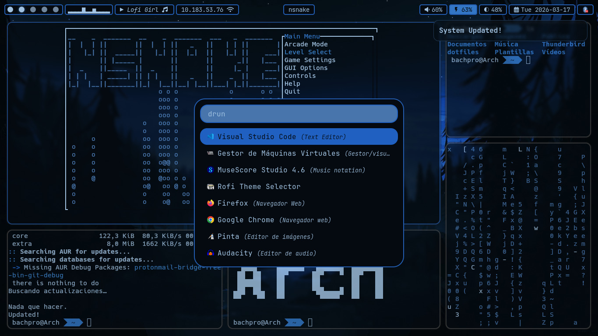
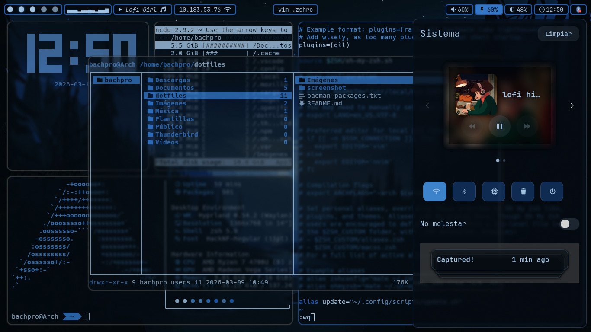

# Skl4vier's chill-dots!

## Preview

<p align="center">
  
</p>

<p align="center">
  
</p>

## Cloning the Repository
To get started, clone the repository to your local machine:
```bash
  git clone https://github.com/sklavier/dotfiles.git
```

## 1. Installation (dependences)

I recommend installing the packages listed in pacman-packages.txt, as these dotfiles rely on them. If you prefer to manage your own programs, you can skip this step.

```bash
  yay -S - < /home/$USER/dotfiles/pacman-packages.txt 
```
Note: If this is a fresh Arch Linux installation, make sure you have yay (https://github.com/Jguer/yay) installed before proceeding.

## 2. Apply Dotfiles
Move the configuration files (dotfiles) to your home directory:

```bash
  cd dotfiles/
  cp -r .* /home/$USER
  cd
  rm -rf ~/.git
```

## 3. Initialize User Directories *(Optional)*
You can exec xdg-user-dirs-update to make as an easy way the basic dirs
```bash
  xdg-user-dirs-update
```